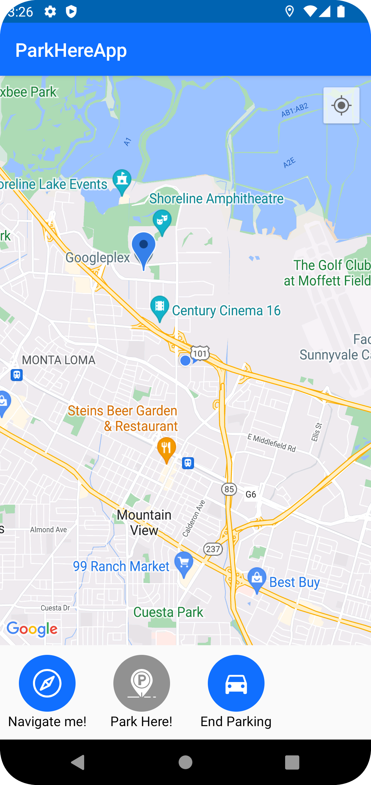

# ParkHereApp 🚘

A simple Android app with Google Maps API v2. Made while learning Google Maps API. While doing this
project I have learned Google Maps API, initializing map in fragments, camera operations, marking
locations and so on. I have trained using GPS and determining the location of user. After 2 years I
have practiced refactoring to MVVM + Clean Architecture. That was quite fun! Because I used best
MVVM practices in first attempt to create this app, it was not so hard to do so :) 

## Installation

* ### Add Google Maps API key
    * Get an API key
      https://developers.google.com/maps/documentation/android-sdk/start
    * Add an API key to local.properties file as shown below:

    ```
    MAPS_API_KEY=your_api_key
    ```

    You don't need to add any quotation marks. 

* ### Build and run!

## 📝 App's features

* GPS Location
* Marks your park location
* Navigate you to your park location with Google Maps

As you see - it's really basic app! 😉

## 🛠 Technology stack 
Kotlin Language - modern language for JVM recommended by Google for Android Development

Google Maps API - most popular maps for Android

Koin - lightweight dependency injection framework

Kotlin Coroutines - asynchronous programming library for Kotlin 

Timber - Jake Wharton's logging library

Room Persistence Library - Abstraction layer for SQLite Database

Jetpack Navigation Component - helps with navigation between fragments (maybe a overkill for this app at the moment)


## Architecture

```
            ┌─────────────────┐
            │    Fragment     │
            └──────────┬──────┘
Presentation           │
            ┌──────────▼──────┐
            │    ViewModel    │
            └──────────┬──────┘
   ────────            │
            ┌──────────▼──────┐
   Domain   │     UseCase     │   UseCases + Pure-Kotlin models
            └──────────┬──────┘         + Repository interfaces
   ────────            │
            ┌──────────▼──────┐
            │     Data        │
            └──────────┬──────┘   Repository implementations
   Data                │
            ┌──────────▼──────┐
            │     Room DB     │    RoomDAO + RoomDatabase + Entities
            └─────────────────┘
```


## Screenshots

<p float="left">



</p>


